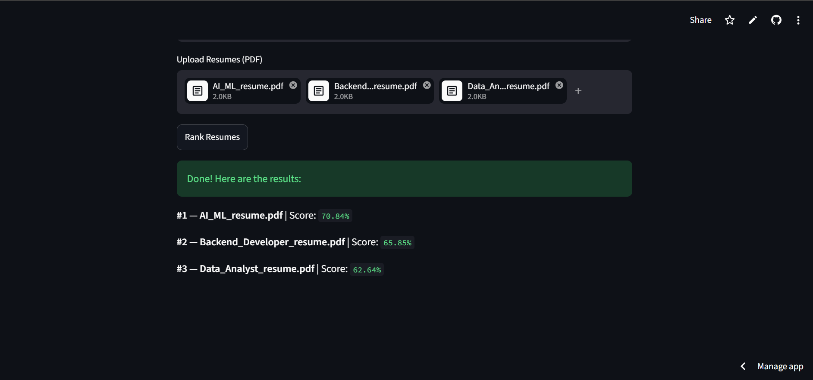

# Resume Screener

An AI-powered resume screening tool that ranks resumes based on how well they match a job description.

## Live Demo
[Try it here](https://resumescreener-2brzqdwd7dsbrxhhot7ghw.streamlit.app/)

## App Preview

## What it does
- Upload a Job Description (PDF)
- Upload multiple Resumes (PDFs)
- Get instant ranked results with match scores

## How it works
Converts text from PDFs into numerical embeddings using a sentence-transformer model, then compares them using cosine similarity to rank resumes by relevance.

## Tech Stack
- Python
- pdfplumber — PDF text extraction
- sentence-transformers — text embeddings
- scikit-learn — cosine similarity
- Streamlit — web UI

## How to run locally
1. Clone the repo
2. Create virtual environment
   python -m venv venv
   venv\Scripts\activate
3. Install dependencies
   pip install -r requirements.txt
4. Run the app
   streamlit run app.py

## Project Structure
- app.py — Streamlit UI
- pdf_parser.py — PDF text extraction
- embedder.py — generates embeddings
- scorer.py — ranks resumes by similarity score
